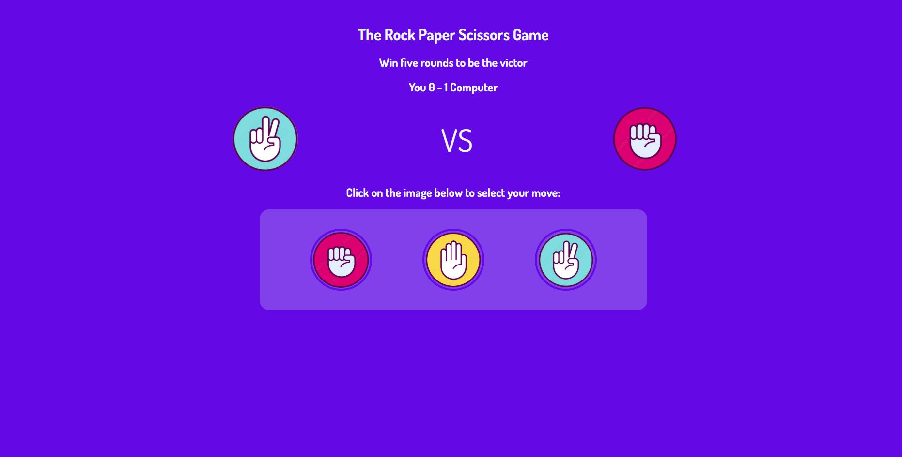

 # 🎮 Rock Paper Scissors Game

## Introduction

Welcome to the **Rock Paper Scissors Game**! This is a simple and interactive web-based game where you can play the classic Rock, Paper, Scissors game against the computer. The project is built using **HTML, CSS, and JavaScript** and is a great beginner-friendly project to demonstrate basic web development and JavaScript logic.

---

## Previews

---

## Features 

* 🎮 Play Rock, Paper, Scissors against the computer.
* ⚡ Instant game results after each round.
* 🎲 Random computer choices for fair gameplay.
* 📱 Responsive and user-friendly interface.
* 💻 Built with HTML, CSS, and JavaScript.

---

## Deployment

You can run this project in either of the following ways:

1. Clone this repository and open the `index.html` file in your web browser.
2. Deploy the project using any static hosting service such as **GitHub Pages**, **Netlify**, or **Vercel**.

---

## Requirements

* A modern web browser (Google Chrome, Mozilla Firefox, Microsoft Edge, etc.).
* Basic knowledge of HTML, CSS, and JavaScript (optional, if you want to understand or modify the code).

---

## How to Use

1. Clone or download this repository.
2. Open the project folder.
3. Double-click the `index.html` file or open it in your preferred web browser.
4. Choose **Rock**, **Paper**, or **Scissors**.
5. The computer will make a random choice, and the winner will be displayed instantly.

---

## Technologies Used

* HTML5
* CSS3
* JavaScript (ES6)

---

## Conclusion

This Rock Paper Scissors Game is a simple yet engaging project that demonstrates the fundamentals of JavaScript, DOM manipulation, and responsive web design. It is an excellent project for beginners who want to practice their front-end development skills. Feel free to explore the code, customize the design, or add new features to make the game even more exciting.
